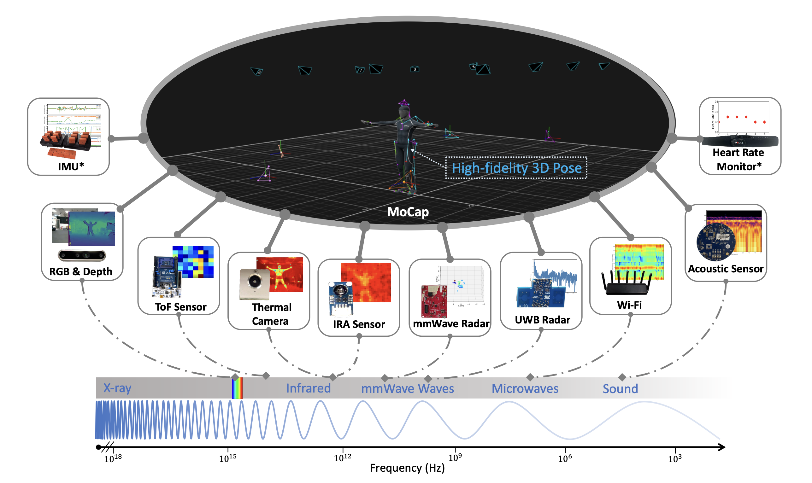

<div align="center">

# 🦑 **OctoNet Toolbox** 🦑

### *The Ultimate Multi-Modal Human Activity Understanding Toolkit*

[](https://aiot-lab.github.io/OctoNet/)
[](https://github.com/aiot-lab/OctoNet)
[](https://img.shields.io/badge/License-GPLv3-blue.svg)

---

### 🎯 **Revolutionary Multi-Modal Dataset for Human Activity Understanding**

*Comprehensive sensor fusion • State-of-the-art benchmarks • Ready-to-use visualization tools*

---

</div>

<div align="center">

</div>

## 🚀 What's Inside This Toolbox

<div align="center">

### ✨ **Comprehensive OctoNet Toolkit** ✨

</div>

This powerful toolbox provides everything you need to work with the OctoNet dataset:

<table>
<tr>
<td align="center" width="50%">

### 🎨 **Visualization Suite**
- **Interactive dataset exploration** tools
- **Multi-modal data visualization** capabilities  

</td>
<td align="center" width="50%">

### ⚡ **Benchmark Framework**
- **Reproducible benchmark** implementations
- **Benchmark results** recordings

</td>
</tr>
</table>

<div align="center">

**🎯 Ready to dive into multi-modal human activity recognition? Let's get started!**

</div>

---
---

<div align="center">

## 🎨 **Part 1: Dataset Visualization & Exploration** 🎨

### *Interactive Multi-Modal Data Analysis Suite*

</div>

<div align="center">

> 💡 **💻 Recommended Environment:** Run the code in Python Jupyter Notebook `demo.ipynb` for the best interactive experience!

</div>

---

### 📁 **Dataset Structure Overview**

<div align="center">

**🗂️ Complete Directory Layout:**

</div>

```bash
./dataset
├── mocap_csv_final          # Data: Final motion capture data in CSV format.
├── mocap_pose               # Data: Final motion capture data in npy format.
├── node_1                   # Data: Data related to multi-modal sensor node 1.
├── node_2                   # Data: Data related to multi-modal sensor node 2.
├── node_3                   # Data: Data related to multi-modal sensor node 3.
├── node_4                   # Data: Data related to multi-modal sensor node 4.
├── node_5                   # Data: Data related to multi-modal sensor node 5.
├── imu                      # Data: Inertial measurement unit data.
├── vayyar_pickle            # Data: vayyar mmWave radar data.
└── cut_manual.csv           # Manually curated data cuts.
```

<div align="center">

### 📊 **Dataset Metadata & Statistics**

</div>

<details>
<summary>🔍 **📋 Click to View Complete OctoNet Dataset Metadata**</summary>

<div align="center">

### 📝 **Key Information:**

</div>

> **📌 Important Notes:**
> - **👥 Gender Classification:** Male (M) and Female (F) participants
> - **🏃 Activity Types:** PA&F indicates subjects performed both **Programmed Aerobics** and **Freestyle** activities
> - **⭐ Special Marking:** Asterisk (*) denotes subjects who performed **only Programmed Aerobics** (no Freestyle)
> - **🏠 Scene Mapping:** Scene 1: IDs 1-99, Scene 2: IDs 101-199, Scene 3: IDs 201-299

</details>

| User (Gender) | Exp ID                   | Scene 1: Activity IDs | Scene 1: PA&F | Scene 2: Activity IDs | Scene 2: PA&F | Scene 3: Activity IDs   | Scene 3: PA&F |
|---------------|--------------------------|:---------------------:|:-------------:|:---------------------:|:-------------:|:-----------------------:|:-------------:|
| 1 (M)         | 1, 11, 101, 201          | all 62                | ✓             | 1–23                  |               | 1–23, 57–62             | ✓*            |
| 2 (M)         | 2, 12, 102, 112, 202     | all 62                | ✓             | 9–29                  | ✓             | 9–29                    |               |
| 3 (M)         | 3, 13, 113, 213          | all 62                | ✓             |                       | ✓             |                         | ✓             |
| 4 (F)         | 4, 14, 104, 114, 204     | all 62                | ✓             | 30–56                 | ✓             | 30–56                   |               |
| 5 (M)         | 5, 15, 115, 215          | all 62                | ✓             |                       | ✓             |                         | ✓             |
| 6 (F)         | 6, 16                    | all 62                | ✓             |                       |               |                         |               |
| 7 (M)         | 7, 17, 117, 217          | all 62                | ✓             |                       | ✓             |                         | ✓             |
| 8 (M)         | 8, 18, 108, 118          | all 62                | ✓             | 24–62                 | ✓             | 24–62                   |               |
| 9 (M)         | 9                        | all 62                |               |                       |               |                         |               |
| 10 (M)        | 10, 20, 120, 220         | all 62                | ✓             |                       | ✓             |                         | ✓             |
| 11 (F)        | 21                       |                       | ✓             |                       |               |                         |               |
| 12 (M)        | 22                       |                       | ✓             |                       |               |                         |               |
| 13 (F)        | 23                       |                       | ✓             |                       |               |                         |               |
| 14 (M)        | 24                       |                       | ✓             |                       |               |                         |               |
| 15 (F)        | 25                       |                       | ✓             |                       |               |                         |               |
| 16 (F)        | 26                       |                       | ✓             |                       |               |                         |               |
| 17 (F)        | 27                       |                       | ✓             |                       |               |                         |               |
| 18 (F)        | 28                       |                       | ✓             |                       |               |                         |               |
| 19 (F)        | 29                       |                       | ✓             |                       |               |                         |               |
| 20 (F)        | 30, 230                  |                       | ✓             |                       |               |                         | ✓             |
| 21 (M)        | 31                       |                       | ✓             |                       |               |                         |               |
| 22 (M)        | 32                       |                       | ✓             |                       |               |                         |               |
| 23 (F)        | 33                       |                       | ✓             |                       |               |                         |               |
| 24 (M)        | 34                       |                       | ✓             |                       |               |                         |               |
| 25 (M)        | 35                       |                       | ✓             |                       |               |                         |               |
| 26 (M)        | 36                       |                       | ✓             |                       |               |                         |               |
| 27 (M)        | 37                       |                       | ✓             |                       |               |                         |               |
| 28 (F)        | 38                       |                       | ✓             |                       |               |                         |               |
| 29 (F)        | 39                       |                       | ✓             |                       |               |                         |               |
| 30 (M)        | 40                       |                       | ✓             |                       |               |                         |               |
| 31 (M)        | 41                       |                       | ✓             |                       |               |                         |               |
| 32 (F)        | 42                       |                       | ✓             |                       |               |                         |               |
| 33 (F)        | 43                       |                       | ✓             |                       |               |                         |               |
| 34 (F)        | 44                       |                       | ✓             |                       |               |                         |               |
| 35 (M)        | 45                       |                       | ✓             |                       |               |                         |               |
| 36 (M)        | 46                       |                       | ✓             |                       |               |                         |               |
| 37 (M)        | 47                       |                       | ✓             |                       |               |                         |               |
| 38 (F)        | 48                       |                       | ✓             |                       |               |                         |               |
| 39 (F)        | 49                       |                       | ✓             |                       |               |                         |               |
| 40 (M)        | 111, 211                 |                       |               | 1–8                   | ✓             | 1–8                     | ✓             |
| 41 (F)        | 121, 221                 |                       |               |                       | ✓             |                         | ✓             |
</details>


---

<div align="center">

## ⚙️ **Environment Setup & Installation** ⚙️

### *Quick Start Guide for OctoNet Development Environment*

</div>

### 🐍 **Step 1: Create Conda Environment**

<div align="center">

**🔧 Automated Environment Creation:**

</div>

```bash
# Create the OctoNet environment from the provided specification
conda env create -f environment.yaml

# Install additional Python packages
pip install -r requirements.txt

# Activate the environment (uncomment when ready)
# conda activate octonet
```

> 💡 **💻 Alternative:** You can skip the conda environment creation if you're using an existing Python environment with compatible packages.

### 🚀 **Step 2: Launch Jupyter Notebook**

<div align="center">

**📓 Start Interactive Development:**

</div>

```bash
# Launch Jupyter Notebook with the OctoNet environment
jupyter notebook demo.ipynb
```

<div align="center">

**🎯 Ready to explore the OctoNet dataset interactively!**

</div>

---

<div align="center">

## 📊 **Sample Data Selection & Configuration** 📊

### *Intelligent Dataset Loading with Flexible Configuration*

</div>

### 🔧 **Core Dataset Loading Function**

<div align="center">

**📁 Smart Dataset Management:**

</div>

In `dataset_loader.py`, we provide a powerful `get_dataset` function that enables flexible dataset loading with comprehensive configuration options:

```python
def get_dataset(config, dataset_path="", mocap_downsample_num = None) -> OctonetDataset:
    """
    Args:
        config: config file
        dataset_path: path to the dataset
        mocap_downsample_num: number of downsample for mocap data, could be shadowed by config['mocap_downsample_num']
    Returns:
        OctonetDataset: a dataset object
    """
    ...
```

### ⚙️ **Complete Configuration Template**

<div align="center">

**🔧 Full Dataset Configuration Options:**

</div>

```python
config = {
    'exp_list': [1, 2, 3, 4, 5, 6, 7, 8, 9, 10, 11, 12, 13, 14, 15, 16, 17, 18, 20, 21, 22, 23, 24, 25, 26, 27, 28, 29, 30, 31, 32, 33, 34, 35, 36, 37, 38, 39, 40, 41, 42, 43, 44, 45, 46, 47, 48, 49, 101, 102, 104, 108, 111, 112, 113, 114, 115, 117, 118, 120, 121, 201, 202, 204, 208, 211, 213, 215, 217, 220, 221, 230]
    'activity_list': ['sit', 'walk', 'bow', 'sleep', 'dance', 'jog', 'falldown', 'jump', 'jumpingjack', 'thunmbup'
        'squat', 'lunge', 'turn', 'pushup', 'legraise', 'airdrum', 'boxing', 'shakehead',
        'answerphone', 'eat', 'drink', 'wipeface', 'pickup', 'jumprope', 'moppingfloor',
        'brushhair', 'bicepcurl', 'playphone', 'brushteeth', 'type', 'thumbup',
        'makeoksign', 'makevictorysign', 'drawcircleclockwise', 'drawcirclecounterclockwise',
        'stopsign', 'pullhandin','pushhandaway', 'handwave', 'sweep', 'clap', 'slide',
        'drawzigzag', 'dodge', 'bowling', 'liftupahand', 'tap', 'spreadandpinch', 'drawtriangle',
        'sneeze', 'cough', 'stagger', 'yawn', 'blownose', 'stretchoneself', 'touchface',
        'handshake', 'hug', 'pushsomeone', 'kicksomeone', 'punchsomeone', 'conversation', 'gym', 'freestyle'],  # Specify which activities to filter
    'node_id': [1, 2, 3, 4, 5], 
    'segmentation_flag': True, # whether to include segmentation in the dataset
    'modality': [ 'mmWave', 'IRA', 'uwb', 'ToF', 'polar', 'wifi', 'depthCamera', 'seekThermal','acoustic', 'imu', 'vayyar', 'mocap'] # depthCamera is RGB-D camera
}
```

### 🎯 **Custom Configuration Example**

<div align="center">

**🔍 Targeted Dataset Selection:**

</div>

To select a specific subset of the dataset, you can customize the configuration. Here's a practical example:
```python
config = {
    'exp_list': [1],  # select exp 1
    'activity_list': ['dance'],  # select activity 'dance'
    'node_id': [1, 2, 3, 4, 5],  # select all nodes
    'segmentation_flag': True, # data is segmented
    'modality': [ 'mmWave', 'IRA', 'uwb', 'ToF', 'polar', 'wifi', 'depthCamera', 'seekThermal','acoustic', 'imu', 'vayyar', 'mocap'], # select all modalities
    # 'modality': ['polar', 'depthCamera'], # select polar and depthCamera modalities
    # 'mocap_downsample_num': 6 # downsample the mocap data to 6 frames per second
}
```

<div align="center">

> 💡 **📝 Smart Loading:** `get_dataset` intelligently includes all available data that matches your configuration criteria!

</div>

---

### 🎨 **Interactive Visualization Suite**

<div align="center">

**📊 Multi-Modal Data Visualization:**

</div>

The comprehensive visualization code is provided in `demo.ipynb`. This interactive notebook will automatically generate:

- **📈 Figures and plots** for data analysis
- **🎬 Video outputs** for temporal data visualization  
- **📁 Organized results** in the `vis_output` folder

```python
# Sample configuration and usage
dataset_path = "dataset"
data_config = {
    'exp_list': [1],  # Specify which experiments to filter
    'activity_list': ['dance'],  
    'node_id': [1, 2, 3, 4, 5], 
    'segmentation_flag': True,
    'modality': [ 'mmWave', 'IRA', 'uwb', 'ToF', 'polar', 'wifi', 'depthCamera', 'seekThermal','acoustic', 'imu', 'vayyar', 'mocap'],
    # 'modality': ['polar', 'depthCamera'],
    # 'mocap_downsample_num': 6
}

# Get the DataLoader
dataset = get_dataset(data_config, dataset_path)
dataloader = get_dataloader(dataset, batch_size=1, shuffle=False, config=data_config)

for batch in dataloader:
    dump_seekthermal_frames_as_png(
        batch, 
        output_dir="validation_seekthermal"
    )
    visualize_seekthermal_and_rgb_mosaic_batch_discard_excess(
        batch,
        output_dir='seekthermal_rgb_mosaic_videos',
        fps_out=8.80
    )
    visualize_3_depth_3_rgb_mosaic_batch_discard_excess(
        batch,
        output_dir='depth_rgb_mosaic_discard',
        fps_out=10
    )
    visualize_4wifi_time_subcarrier_with_camera(
        batch,
        output_dir='wifi_rgb_mosaic_videos',
        fps_out=10.0,
        BW="40MHz"
    )
    visualize_ira_and_rgb_mosaic_batch_downsample_cam(
        batch,
        output_dir='ira_rgb_mosaic_videos',
        fps_out=6.91
    )
    visualize_mocap_and_rgb_mosaic_batch_downsample_mocap(
        batch,
        output_dir='mocap_rgb_mosaic_videos',
        fps_out=10
    )
    visualize_tof_and_rgb_mosaic_batch_downsample_tof(
        batch,
        output_dir='tof_rgb_mosaic_videos',
        fps_out=7.32
    )
    visualize_fmcw_and_rgb_mosaic_batch_raw_fixed_axes(
        batch,
        output_dir='fmcw_rgb_mosaic',
        fps_out=8.81
    )
    visualize_vayyar_txrx_only_and_camera(
        batch,
        output_dir="vayyar_rgb_mosaic",
        fps_out=10.0
    )
    visualize_acoustic_2node_melspectrogram_and_rgb(
        batch,
        output_dir="acoustic_melspec_plus_rgb",
        fps_out=10.0
    )
    visualize_polar_and_camera_batch(
        batch,
        output_dir="polar_hr_plus_rgb",
        fps_out=10.0,
        y_domain=None
    )
    visualize_imu_four_rows_no_zscore(
        batch,
        output_dir="imu_time_features_plus_rgb",
        fps_out=10.0
    )
    visualize_uwb_and_rgb_in_same_row_with_box(
        batch,
        output_dir="uwb_rgb_same_row_with_box",
        fps_out=10.0
    )
    break
```
---

<div align="center">

## ⚡ **Part 2: Benchmark & Reproducible Results** ⚡

### *State-of-the-Art Performance Evaluation Framework*

</div>

<div align="center">

**🏆 Comprehensive benchmarking suite for the OctoNet dataset with reproducible results and performance comparisons.**

</div>

### 🚀 **Step 1: Environment Setup**

<div align="center">

**📁 Navigate to Benchmark Directory:**

</div>

```bash
# Change to the benchmark directory
cd OctonetBenchmark
```

<div align="center">

**🐍 Python Environment Requirements:**

</div>

> **📋 Recommended:** Python 3.9–3.11 with our pre-configured Conda environment

<div align="center">

**🔧 Automated Environment Creation:**

</div>

```bash
# Create the benchmark environment from the provided specification
conda env create -f environment.yml

# Activate the environment (name defined in environment.yml)
conda activate octo

# (Optional) Update existing environment after changes
conda env update -f environment.yml --prune
```

<div align="center">

**💡 Important Notes:**

</div>

> **🎮 GPU Support:** The `environment.yml` includes GPU-enabled PyTorch and CUDA libraries. For CPU-only setups, remove CUDA-related packages (`pytorch-cuda`, `cudnn`, `cuda-*`) and the `nvidia` channel.

> **⚡ Performance Tip:** If conda solver struggles, try using `mamba` as a faster drop-in replacement for `conda`.

### 📥 **Step 2: Dataset Download**

<div align="center">

**🌐 Official Dataset Sources:**

</div>

**📊 Primary Source:** [Hugging Face Dataset](https://huggingface.co/datasets/hku-aiot/OctoNet)  
**💻 Code Repository:** [GitHub Repository](https://github.com/aiot-lab/OctoNet)

<div align="center">

**⚡ Automated Download Process:**

</div>

The dataset provider offers an automated script that downloads 16 chunks, merges, and extracts them seamlessly.

> **💾 Storage Requirements:** ~1.5TB peak disk space during download and extraction

```bash
# One-command automated download and extraction
bash -c "$(wget -qO- https://huggingface.co/datasets/hku-aiot/OctoNet/resolve/main/download_octonet.sh)"
```

<div align="center">

**📁 Expected Dataset Structure:**

</div>

After download and extraction, ensure you have the following structure under a directory named `dataset` (you can choose a different parent path):

```bash
./dataset
├── mocap_csv_final          # Data: Final motion capture data in CSV format.
├── mocap_pose               # Data: Final motion capture data in npy format.
├── node_1                   # Data: Data related to multi-modal sensor node 1.
├── node_2                   # Data: Data related to multi-modal sensor node 2.
├── node_3                   # Data: Data related to multi-modal sensor node 3.
├── node_4                   # Data: Data related to multi-modal sensor node 4.
├── node_5                   # Data: Data related to multi-modal sensor node 5.
├── imu                      # Data: Inertial measurement unit data.
├── vayyar_pickle            # Data: vayyar mmWave radar data.
└── cut_manual.csv           # Manually curated data cuts.
```


### 🔧 **Step 3: Dataset Preparation**

<div align="center">

**📦 Benchmark-Specific Setup:**

</div>

Rename the dataset directory to `octonet` and place the dataset helper script `Octonet.py` inside it. You should end up with:

```bash
./octonet
├── mocap_csv_final          # Data: Final motion capture data in CSV format.
├── mocap_pose               # Data: Final motion capture data in npy format.
├── node_1                   # Data: Data related to multi-modal sensor node 1.
├── node_2                   # Data: Data related to multi-modal sensor node 2.
├── node_3                   # Data: Data related to multi-modal sensor node 3.
├── node_4                   # Data: Data related to multi-modal sensor node 4.
├── node_5                   # Data: Data related to multi-modal sensor node 5.
├── imu                      # Data: Inertial measurement unit data.
├── vayyar_pickle            # Data: vayyar mmWave radar data.
├── Octonet.py               # script: contains the dataset PyTorch functions and dataloader
└── cut_manual.csv           # Manually curated data cuts.
```

<div align="center">

**⚠️ Important Setup Notes:**

</div>

> **📁 Folder Naming:** This repository imports dataset utilities via `from octonet.Octonet import get_dataset, custom_collate`. The folder name must be exactly `octonet`.

> **📍 Custom Paths:** If you downloaded to a different location, set `dataset_path` in your chosen configuration file to the absolute path of your `octonet` folder.

### ⚙️ **Step 4: Configuration Selection**

<div align="center">

**🎯 Choose Your Benchmark Configuration:**

</div>

To reproduce the paper results, select the corresponding configuration YAML listed in the results table below. Example configurations already included:

<div align="center">

**📋 Available Configurations:**

</div>

- `Configurations/acoustic_denesnet121_10.yaml`
- `Configurations/ira_rf_net_pose.yaml`

> **💡 Usage Tip:** Pass the config name without the `.yaml` suffix to the `--config_file` flag.

---

### 🚀 **Step 5: Execute Benchmarks**

<div align="center">

**⚡ Running Your Selected Configuration:**

</div>

**🎯 Training + Testing (Full Pipeline):**
```bash
python main.py --config_file acoustic_denesnet121_10 --cuda_index 0 --mode 0
```

**🧪 Testing Only (Pre-trained Model):**
```bash
python main.py --config_file acoustic_denesnet121_10 --cuda_index 0 --mode 1 --pretrained_model /absolute/path/to/weights.pth
```

**🔄 Fine-tuning + Testing:**
```bash
python main.py --config_file ira_rf_net_pose --cuda_index 0 --mode 2 --pretrained_model /absolute/path/to/weights.pth
```

<div align="center">

**💾 Model Saving Configuration:**

</div>

> **🔧 To save trained model weights:** Change `model_save_enable: False` to `model_save_enable: True` in your selected configuration file. Control output paths via `trained_model_folder`, `log_folder`, and `tensorboard_folder` in the same YAML.

---

<div align="center">

## 📊 **Reproducible Results & Performance Tables** 📊

### *Complete Benchmark Results with Configurations, Runs, and Logs*

</div>

<div align="center">

**📁 Additional Resources:**

</div>

> **💾 Large Log Files:** Download the logs folder and place it in the same directory as the 'Configurations' folder.  
> **🔗 Download Link:** [SharePoint Logs Repository](https://connecthkuhk-my.sharepoint.com/:f:/g/personal/zhangxie_connect_hku_hk/EvArkmSXcqFFr_3wxC2JiJoB74qWYSvguqW0ejbE7w4XxQ?e=c9yhfE)

---

<div align="center">

## 🏃 **Human Activity Recognition Results** 🏃

### *Multi-Modal Performance Comparison*

</div>

| Modality | Protocol | ResNet 10/62 | DenseNet 10/62 | Swin-T 10/62 | RFNet 10/62 |
| --- | --- | --- | --- | --- | --- |
| **RGB** | **ID** | 91.5 (±2.6) [Config](./Configurations/rgbCamera_resnet18_10_n_1fps_batch_32.yaml) <br> [Log](./logs/rgbCamera/rgbCamera_resnet18_10_n_1fps_batch_32_resnet18_1013191007.pkl) <br> [Run](./runs/rgbCamera/rgbCamera_resnet18_10_n_1fps_batch_32_resnet18_1013191007) / 93.4 (±0.9) [Config](./Configurations/rgbCamera_resnet18_62_n_1fps.yaml) <br> [Log](./logs/rgbCamera/rgbCamera_resnet18_62_n_1fps_resnet18_0928222212.pkl) <br> [Run](./runs/rgbCamera/rgbCamera_resnet18_62_n_1fps_resnet18_0928222212) | 93.2 (±2.3) [Config](./Configurations/rgbCamera_densenet121_10_n_1fps.yaml) <br> [Log](./logs/rgbCamera/rgbCamera_densenet121_10_n_1fps_densenet121_0929044852.pkl) <br> [Run](./runs/rgbCamera/rgbCamera_densenet121_10_n_1fps_densenet121_0929044852) / 91.2 (±1.0) [Config](./Configurations/rgbCamera_densenet121_62_n_1fps.yaml) <br> [Log](./logs/rgbCamera/rgbCamera_densenet121_62_n_1fps_densenet121_0929055155.pkl) <br> [Run](./runs/rgbCamera/rgbCamera_densenet121_62_n_1fps_densenet121_0929055155) | 94.9 (±2.0) [Config](./Configurations/rgbCamera_swin_t_10_n_1fps.yaml) <br> [Log](./logs/rgbCamera/rgbCamera_swin_t_10_n_1fps_swin_t_0929114226.pkl) <br> [Run](./runs/rgbCamera/rgbCamera_swin_t_10_n_1fps_swin_t_0929114226) / 93.1 (±0.9) [Config](./Configurations/rgbCamera_swin_t_62_n_1fps.yaml) <br> [Log](./logs/rgbCamera/rgbCamera_swin_t_62_n_1fps_swin_t_0929122927.pkl) <br> [Run](./runs/rgbCamera/rgbCamera_swin_t_62_n_1fps_swin_t_0929122927) | 89.7 (±2.8) [Config](./Configurations/rgbCamera_rf_net_10_n_1fps.yaml) <br> [Log](./logs/rgbCamera/rgbCamera_rf_net_10_n_1fps_rf_net_0929185448.pkl) <br> [Run](./runs/rgbCamera/rgbCamera_rf_net_10_n_1fps_rf_net_0929185448) / 60.9 (±1.8) [Config](./Configurations/rgbCamera_rf_net_62_n_1fps.yaml) <br> [Log](./logs/rgbCamera/rgbCamera_rf_net_62_n_1fps_rf_net_0929200417.pkl) <br> [Run](./runs/rgbCamera/rgbCamera_rf_net_62_n_1fps_rf_net_0929200417) |
|  | **CU** | 46.0 (±3.4) [Log](./logs/rgbCamera/rgbCamera_resnet18_10_n_1fps_batch_32_resnet18_1013191007_cross_user.pkl) / 12.3 (±0.9) [Log](./logs/rgbCamera/rgbCamera_resnet18_62_n_1fps_resnet18_0928222212_cross_user.pkl) | 68.2 (±3.2) [Log](./logs/rgbCamera/rgbCamera_densenet121_10_n_1fps_densenet121_0929044852_cross_user.pkl) / 24.7 (±1.2) [Log](./logs/rgbCamera/rgbCamera_densenet121_62_n_1fps_densenet121_0929055155_cross_user.pkl) | 37.0 (±3.3) [Log](./logs/rgbCamera/rgbCamera_swin_t_10_n_1fps_swin_t_0929114226_cross_user.pkl) / 7.7 (±0.7) [Log](./logs/rgbCamera/rgbCamera_swin_t_62_n_1fps_swin_t_0929122927_cross_user.pkl) | 45.0 (±3.4) [Log](./logs/rgbCamera/rgbCamera_rf_net_10_n_1fps_rf_net_0929185448_cross_user.pkl) / 9.2 (±0.8) [Log](./logs/rgbCamera/rgbCamera_rf_net_62_n_1fps_rf_net_0929200417_cross_user.pkl) |
|  | **CS** | 14.9 (±3.0) [Log](./logs/rgbCamera/rgbCamera_resnet18_10_n_1fps_batch_32_resnet18_1013191007_cross_domain.pkl) / 4.1 (±0.7) [Log](./logs/rgbCamera/rgbCamera_resnet18_62_n_1fps_resnet18_0928222212_cross_domain.pkl) | 33.3 (±4.0) [Log](./logs/rgbCamera/rgbCamera_densenet121_10_n_1fps_densenet121_0929044852_cross_domain.pkl) /  11.3 (±1.1) [Log](./logs/rgbCamera/rgbCamera_densenet121_62_n_1fps_densenet121_0929055155_cross_domain.pkl) | 12.1 (±2.8) [Log](./logs/rgbCamera/rgbCamera_swin_t_10_n_1fps_swin_t_0929114226_cross_domain.pkl) /  1.7 (±0.4) [Log](./logs/rgbCamera/rgbCamera_swin_t_62_n_1fps_swin_t_0929122927_cross_domain.pkl) | 13.5 (±2.9) [Log](./logs/rgbCamera/rgbCamera_rf_net_10_n_1fps_rf_net_0929185448_cross_domain.pkl) / 3.1 (±0.6) [Log](./logs/rgbCamera/rgbCamera_rf_net_62_n_1fps_rf_net_0929200417_cross_domain.pkl) |
| **Depth** | **ID** | 89.7 (±2.8) [Config](./Configurations/depthCamera_resnet18_10_n_1fps_mask_withoutnorm.yaml) <br> [Log](./logs/depthCamera/depthCamera_resnet18_10_n_1fps_mask_withoutnorm_resnet18_1011015302.pkl) <br> [Run](./runs/depthCamera/depthCamera_resnet18_10_n_1fps_mask_withoutnorm_resnet18_1011015302) / 86.6 (±1.2) [Config](./Configurations/depthCamera_resnet18_62_n_1fps_mask_withoutnorm.yaml) <br> [Log](./logs/depthCamera/depthCamera_resnet18_62_n_1fps_mask_withoutnorm_resnet18_1011025409.pkl) <br> [Run](./runs/depthCamera/depthCamera_resnet18_62_n_1fps_mask_withoutnorm_resnet18_1011025409) | 90.6 (±2.7) [Config](./Configurations/depthCamera_densenet121_10_n_1fps_mask_withoutnorm.yaml) <br> [Log](./logs/depthCamera/depthCamera_densenet121_10_n_1fps_mask_withoutnorm_densenet121_1011085357.pkl) <br> [Run](./runs/depthCamera/depthCamera_densenet121_10_n_1fps_mask_withoutnorm_densenet121_1011085357) / 83.2 (±1.3) [Config](./Configurations/depthCamera_densenet121_62_n_1fps_mask_withoutnorm.yaml) <br> [Log](./logs/depthCamera/depthCamera_densenet121_62_n_1fps_mask_withoutnorm_densenet121_1011095401.pkl) <br> [Run](./runs/depthCamera/depthCamera_densenet121_62_n_1fps_mask_withoutnorm_densenet121_1011095401) | 86.3 (±3.2) [Config](./Configurations/depthCamera_swin_t_10_n_1fps_mask_withoutnorm.yaml) <br> [Log](./logs/depthCamera/depthCamera_swin_t_10_n_1fps_mask_withoutnorm_swin_t_1010180614.pkl) <br> [Run](./runs/depthCamera/depthCamera_swin_t_10_n_1fps_mask_withoutnorm_swin_t_1010180614) / 81.7 (±1.4) [Config](./Configurations/depthCamera_swin_t_62_n_1fps_mask_withoutnorm.yaml) <br> [Log](./logs/depthCamera/depthCamera_swin_t_62_n_1fps_mask_withoutnorm_swin_t_1010194246.pkl) <br> [Run](./runs/depthCamera/depthCamera_swin_t_62_n_1fps_mask_withoutnorm_swin_t_1010194246) | 87.2 (±3.1) [Config](./Configurations/depthCamera_rf_net_10_n_1fps_mask_withoutnorm.yaml) <br> [Log](./logs/depthCamera/depthCamera_rf_net_10_n_1fps_mask_withoutnorm_rf_net_1011153510.pkl) <br> [Run](./runs/depthCamera/depthCamera_rf_net_10_n_1fps_mask_withoutnorm_rf_net_1011153510) / 40.0 (±1.8) [Config](./Configurations/depthCamera_rf_net_62_n_1fps_mask_withoutnorm.yaml) <br> [Log](./logs/depthCamera/depthCamera_rf_net_62_n_1fps_mask_withoutnorm_rf_net_1011163601.pkl) <br> [Run](./runs/depthCamera/depthCamera_rf_net_62_n_1fps_mask_withoutnorm_rf_net_1011163601) |
|  | **CU** | 41.2 (±3.4) [Log](./logs/depthCamera/depthCamera_resnet18_10_n_1fps_mask_withoutnorm_resnet18_1011015302_cross_user.pkl) / 11.1 (±0.9) [Log](./logs/depthCamera/depthCamera_resnet18_62_n_1fps_mask_withoutnorm_resnet18_1011025409_cross_user.pkl) | 64.9 (±3.3) [Log](./logs/depthCamera/depthCamera_densenet121_10_n_1fps_mask_withoutnorm_densenet121_1011085357_cross_user.pkl) / 27.3 (±1.2) [Log](./logs/depthCamera/depthCamera_densenet121_62_n_1fps_mask_withoutnorm_densenet121_1011095401_cross_user.pkl) | 46.0 (±3.4) [Log](./logs/depthCamera/depthCamera_swin_t_10_n_1fps_mask_withoutnorm_swin_t_1010180614_cross_user.pkl) / 14.4 (±1.0) [Log](./logs/depthCamera/depthCamera_swin_t_62_n_1fps_mask_withoutnorm_swin_t_1010194246_cross_user.pkl) | 45.0 (±3.4) [Log](./logs/depthCamera/depthCamera_rf_net_10_n_1fps_mask_withoutnorm_rf_net_1011153510_cross_user.pkl) / 11.2 (±0.9) [Log](./logs/depthCamera/depthCamera_rf_net_62_n_1fps_mask_withoutnorm_rf_net_1011163601_cross_user.pkl) |
|  | **CS** | 17.7 (±3.2) [Log](./logs/depthCamera/depthCamera_resnet18_10_n_1fps_mask_withoutnorm_resnet18_1011015302_cross_domain.pkl) / 3.9 (±0.7) [Log](./logs/depthCamera/depthCamera_resnet18_62_n_1fps_mask_withoutnorm_resnet18_1011025409_cross_domain.pkl) | 22.7 (±3.5) [Log](./logs/depthCamera/depthCamera_densenet121_10_n_1fps_mask_withoutnorm_densenet121_1011085357_cross_domain.pkl) / 12.2 (±1.1) [Log](./logs/depthCamera/depthCamera_densenet121_62_n_1fps_mask_withoutnorm_densenet121_1011095401_cross_domain.pkl) | 23.4 (±3.6) [Log](./logs/depthCamera/depthCamera_swin_t_10_n_1fps_mask_withoutnorm_swin_t_1010180614_cross_domain.pkl) / 4.3 (±0.7) [Log](./logs/depthCamera/depthCamera_swin_t_62_n_1fps_mask_withoutnorm_swin_t_1010194246_cross_domain.pkl) | 28.4 (±3.8) [Log](./logs/depthCamera/depthCamera_rf_net_10_n_1fps_mask_withoutnorm_rf_net_1011153510_cross_domain.pkl) / 4.8 (±0.7) [Log](./logs/depthCamera/depthCamera_rf_net_62_n_1fps_mask_withoutnorm_rf_net_1011163601_cross_domain.pkl) |
| **ToF** | **ID** | 86.8 (±3.1) [Config](./Configurations/ToF_resnet18_10_n.yaml) <br> [Log](./logs/ToF/ToF_resnet18_10_n_resnet18_1002173559.pkl) <br> [Run](./runs/ToF/ToF_resnet18_10_n_resnet18_1002173559) / 70.3 (±1.6) [Config](./Configurations/ToF_resnet18_62_n.yaml) <br> [Log](./logs/ToF/ToF_resnet18_62_n_resnet18_1002150241.pkl) <br> [Run](./runs/ToF/ToF_resnet18_62_n_resnet18_1002150241) | N/A | 82.6 (±3.5) [Config](./Configurations/ToF_swin_t_10_n.yaml) <br> [Log](./logs/ToF/ToF_swin_t_10_n_swin_t_1002195556.pkl) <br> [Run](./runs/ToF/ToF_swin_t_10_n_swin_t_1002195556) / 51.8 (±1.8) [Config](./Configurations/ToF_swin_t_62_n.yaml) <br> [Log](./logs/ToF/ToF_swin_t_62_n_swin_t_1002190606.pkl) <br> [Run](./runs/ToF/ToF_swin_t_62_n_swin_t_1002190606) | 89.3 (±2.8) [Config](./Configurations/ToF_rf_net_10_n.yaml) <br> [Log](./logs/ToF/ToF_rf_net_10_n_rf_net_1002205200.pkl) <br> [Run](./runs/ToF/ToF_rf_net_10_n_rf_net_1002205200) / 75.9 (±1.5) [Config](./Configurations/ToF_rf_net_62_n.yaml) <br> [Log](./logs/ToF/ToF_rf_net_62_n_rf_net_1002200335.pkl) <br> [Run](./runs/ToF/ToF_rf_net_62_n_rf_net_1002200335) |
|  | **CU** | 44.5 (±3.4) [Log](./logs/ToF/ToF_resnet18_10_n_resnet18_1002173559_cross_user.pkl) / 11.8 (±0.9) [Log](./logs/ToF/ToF_resnet18_62_n_resnet18_1002150241_cross_user.pkl) | N/A | 46.4 (±3.4) [Log](./logs/ToF/ToF_swin_t_10_n_swin_t_1002195556_cross_user.pkl) / 15.3 (±1.0) [Log](./logs/ToF/ToF_swin_t_62_n_swin_t_1002190606_cross_user.pkl) | 78.7 (±2.8) [Log](./logs/ToF/ToF_rf_net_10_n_rf_net_1002205200_cross_user.pkl) / 28.3 (±1.2) [Log](./logs/ToF/ToF_rf_net_62_n_rf_net_1002200335_cross_user.pkl) |
|  | **CS** | 25.5 (±3.7) [Log](./logs/ToF/ToF_resnet18_10_n_resnet18_1002173559_cross_domain.pkl) / 8.0 (±0.9) [Log](./logs/ToF/ToF_resnet18_62_n_resnet18_1002150241_cross_domain.pkl) | N/A | 22.7 (±3.5) [Log](./logs/ToF/ToF_swin_t_10_n_swin_t_1002195556_cross_domain.pkl) / 4.7 (±0.7) [Log](./logs/ToF/ToF_swin_t_62_n_swin_t_1002190606_cross_domain.pkl) | 44.7 (±4.2) [Log](./logs/ToF/ToF_rf_net_10_n_rf_net_1002205200_cross_domain.pkl) / 18.6 (±1.3) [Log](./logs/ToF/ToF_rf_net_62_n_rf_net_1002200335_cross_domain.pkl) |
| **Thermal** | **ID** | 90.1 (±2.7) [Config](./Configurations/seekThermal_resnet18_10_n_1fps.yaml) <br> [Log](./logs/seekThermal/seekThermal_resnet18_10_n_1fps_resnet18_1008161907.pkl) <br> [Run](./runs/seekThermal/seekThermal_resnet18_10_n_1fps_resnet18_1008161907) / 85.0 (±1.3) [Config](./Configurations/seekThermal_resnet18_62_n_1fps.yaml) <br> [Log](./logs/seekThermal/seekThermal_resnet18_62_n_1fps_resnet18_1008152518.pkl) <br> [Run](./runs/seekThermal/seekThermal_resnet18_62_n_1fps_resnet18_1008152518) | 91.7 (±2.5) [Config](./Configurations/seekThermal_densenet121_10_n_1fps.yaml) <br> [Log](./logs/seekThermal/seekThermal_densenet121_10_n_1fps_densenet121_1008162946.pkl) <br> [Run](./runs/seekThermal/seekThermal_densenet121_10_n_1fps_densenet121_1008162946) / 85.4 (±1.3) [Config](./Configurations/seekThermal_densenet121_62_n_1fps.yaml) <br> [Log](./logs/seekThermal/seekThermal_densenet121_62_n_1fps_densenet121_1008163944.pkl) <br> [Run](./runs/seekThermal/seekThermal_densenet121_62_n_1fps_densenet121_1008163944) | 85.1 (±3.2) [Config](./Configurations/seekThermal_swin_t_10_n_1fps.yaml) <br> [Log](./logs/seekThermal/seekThermal_swin_t_10_n_1fps_swin_t_1008151518.pkl) <br> [Run](./runs/seekThermal/seekThermal_swin_t_10_n_1fps_swin_t_1008151518) / 79.2 (±1.5) [Config](./Configurations/seekThermal_swin_t_62_n_1fps.yaml) <br> [Log](./logs/seekThermal/seekThermal_swin_t_62_n_1fps_swin_t_1006121705.pkl) <br> [Run](./runs/seekThermal/seekThermal_swin_t_62_n_1fps_swin_t_1006121705) | 47.1 (±4.6) [Config](./Configurations/seekThermal_rf_net_10_n_1fps.yaml) <br> [Log](./logs/seekThermal/seekThermal_rf_net_10_n_1fps_rf_net_1008175013.pkl) <br> [Run](./runs/seekThermal/seekThermal_rf_net_10_n_1fps_rf_net_1008175013) / 28.6 (±1.6) [Config](./Configurations/seekThermal_rf_net_62_n_1fps.yaml) <br> [Log](./logs/seekThermal/seekThermal_rf_net_62_n_1fps_rf_net_1008180140.pkl) <br> [Run](./runs/seekThermal/seekThermal_rf_net_62_n_1fps_rf_net_1008180140) |
|  | **CU** | 50.2 (±3.5) [Log](./logs/seekThermal/seekThermal_resnet18_10_n_1fps_resnet18_1008161907_cross_user.pkl) / 25.7 (±1.2) [Log](./logs/seekThermal/seekThermal_resnet18_62_n_1fps_resnet18_1008152518_cross_user.pkl) | 64.5 (±3.4) [Log](./logs/seekThermal/seekThermal_densenet121_10_n_1fps_densenet121_1008162946_cross_user.pkl) / 32.5 (±1.3) [Log](./logs/seekThermal/seekThermal_densenet121_62_n_1fps_densenet121_1008163944_cross_user.pkl) | 46.8 (±3.5) [Log](./logs/seekThermal/seekThermal_swin_t_10_n_1fps_swin_t_1008151518_cross_user.pkl) / 15.6 (±1.0) [Log](./logs/seekThermal/seekThermal_swin_t_62_n_1fps_swin_t_1006121705_cross_user.pkl) | 15.3 (±2.5) [Log](./logs/seekThermal/seekThermal_rf_net_10_n_1fps_rf_net_1008175013_cross_user.pkl) / 1.0 (±0.3) [Log](./logs/seekThermal/seekThermal_rf_net_62_n_1fps_rf_net_1008180140_cross_user.pkl) |
|  | **CS** | 36.9 (±4.1) [Log](./logs/seekThermal/seekThermal_resnet18_10_n_1fps_resnet18_1008161907_cross_domain.pkl) / 13.4 (±1.2) [Log](./logs/seekThermal/seekThermal_resnet18_62_n_1fps_resnet18_1008152518_cross_domain.pkl) | 44.0 (±4.2) [Log](./logs/seekThermal/seekThermal_densenet121_10_n_1fps_densenet121_1008162946_cross_domain.pkl) / 21.0 (±1.4) [Log](./logs/seekThermal/seekThermal_densenet121_62_n_1fps_densenet121_1008163944_cross_domain.pkl) | 36.2 (±4.1) [Log](./logs/seekThermal/seekThermal_swin_t_10_n_1fps_swin_t_1008151518_cross_domain.pkl) / 10.1 (±1.0) [Log](./logs/seekThermal/seekThermal_swin_t_62_n_1fps_swin_t_1006121705_cross_domain.pkl) | 17.7 (±3.2) [Log](./logs/seekThermal/seekThermal_rf_net_10_n_1fps_rf_net_1008175013_cross_domain.pkl) / 2.1 (±0.5) [Log](./logs/seekThermal/seekThermal_rf_net_62_n_1fps_rf_net_1008180140_cross_domain.pkl) |
| **IRA** | **ID** | 25.6 (±4.0) [Config](./Configurations/ira_resnet18_10_n.yaml) <br> [Log](./logs/ira/ira_resnet18_10_n_resnet18_1002152000.pkl) <br> [Run](./runs/ira/ira_resnet18_10_n_resnet18_1002152000) / 1.8 (±0.5) [Config](./Configurations/ira_resnet_62.yaml) <br> [Log](./logs/ira/ira_resnet_62_resnet18_0408104550.pkl) <br> [Run](./runs/ira/ira_resnet_62_resnet18_0408104550) | N/A | 14.0 (±3.2) [Config](./Configurations/ira_swin_t_10.yaml) <br> [Log](./logs/ira/ira_swin_t_10_swin_t_0407214128.pkl) <br> [Run](./runs/ira/ira_swin_t_10_swin_t_0407214128) / 3.7 (±0.7) [Config](./Configurations/ira_swin_t_62_n.yaml) <br> [Log](./logs/ira/ira_swin_t_62_n_swin_t_1002164515.pkl) <br> [Run](./runs/ira/ira_swin_t_62_n_swin_t_1002164515) | 19.0 (±3.6) [Config](./Configurations/ira_rf_net_10.yaml) <br> [Log](./logs/ira/ira_rf_net_10_rf_net_0402152150.pkl) <br> [Run](./runs/ira/ira_rf_net_10_rf_net_0402152150) / 4.2 (±0.7) [Config](./Configurations/ira_rf_net_62.yaml) <br> [Log](./logs/ira/ira_rf_net_62_rf_net_0402155141.pkl) <br> [Run](./runs/ira/ira_rf_net_62_rf_net_0402155141) |
|  | **CU** | 19.9 (±2.8) [Log](./logs/ira/ira_resnet18_10_n_resnet18_1002152000_cross_user.pkl) / 2.6 (±0.4) [Log](./logs/ira/ira_resnet_62_resnet18_0408104550_cross_user.pkl) | N/A | 22.3 (±2.9) [Log](./logs/ira/ira_swin_t_10_swin_t_0407214128_cross_user.pkl) / 2.8 (±0.4) [Log](./logs/ira/ira_swin_t_62_n_swin_t_1002164515_cross_user.pkl) | 21.8 (±2.8) [Log](./logs/ira/ira_rf_net_10_rf_net_0402152150_cross_user.pkl) / 3.2 (±0.5) [Log](./logs/ira/ira_rf_net_62_rf_net_0402155141_cross_user.pkl) |
|  | **CS** | 18.4 (±3.3) [Log](./logs/ira/ira_resnet18_10_n_resnet18_1002152000_cross_domain.pkl) / 0.8 (±0.3) [Log](./logs/ira/ira_resnet_62_resnet18_0408104550_cross_domain.pkl) | N/A | 20.6 (±3.4) [Log](./logs/ira/ira_swin_t_10_swin_t_0407214128_cross_domain.pkl) / 3.8 (±0.6) [Log](./logs/ira/ira_swin_t_62_n_swin_t_1002164515_cross_domain.pkl) | 21.3 (±3.5) [Log](./logs/ira/ira_rf_net_10_rf_net_0402152150_cross_domain.pkl) / 2.7 (±0.6) [Log](./logs/ira/ira_rf_net_62_rf_net_0402155141_cross_domain.pkl) |
| **FMCW** | **ID** | 39.3 (±4.5) [Config](./Configurations/mmWave_resnet18_10_n.yaml) <br> [Log](./logs/mmWave/mmWave_resnet18_10_n_resnet18_1002210502.pkl) <br> [Run](./runs/mmWave/mmWave_resnet18_10_n_resnet18_1002210502) / 24.0 (±1.6) [Config](./Configurations/mmWave_resnet18_62_n.yaml) <br> [Log](./logs/mmWave/mmWave_resnet18_62_n_resnet18_1002215248.pkl) <br> [Run](./runs/mmWave/mmWave_resnet18_62_n_resnet18_1002215248) | 74.4 (±4.1) [Config](./Configurations/mmWave_densenet121_10_n.yaml) <br> [Log](./logs/mmWave/mmWave_densenet121_10_n_densenet121_1003024928.pkl) <br> [Run](./runs/mmWave/mmWave_densenet121_10_n_densenet121_1003024928) / 46.3 (±1.8) [Config](./Configurations/mmWave_densenet121_62_n.yaml) <br> [Log](./logs/mmWave/mmWave_densenet121_62_n_densenet121_1003033347.pkl) <br> [Run](./runs/mmWave/mmWave_densenet121_62_n_densenet121_1003033347) | 36.8 (±4.5) [Config](./Configurations/mmWave_swin_t_10_n.yaml) <br> [Log](./logs/mmWave/mmWave_swin_t_10_n_swin_t_1003081913.pkl) <br> [Run](./runs/mmWave/mmWave_swin_t_10_n_swin_t_1003081913) / 5.0 (±0.8) [Config](./Configurations/mmWave_swin_t_62_n.yaml) <br> [Log](./logs/mmWave/mmWave_swin_t_62_n_swin_t_1003085857.pkl) <br> [Run](./runs/mmWave/mmWave_swin_t_62_n_swin_t_1003085857) | 38.5 (±4.5) [Config](./Configurations/mmWave_rf_net_10.yaml) <br> [Log](./logs/mmWave/mmWave_rf_net_10_rf_net_0402142714.pkl) <br> [Run](./runs/mmWave/mmWave_rf_net_10_rf_net_0402142714) / 12.6 (±1.2) [Config](./Configurations/mmWave_rf_net_62.yaml) <br> [Log](./logs/mmWave/mmWave_rf_net_62_rf_net_0402152044.pkl) <br> [Run](./runs/mmWave/mmWave_rf_net_62_rf_net_0402152044) |
|  | **CU** | 27.0 (±3.1) [Log](./logs/mmWave/mmWave_resnet18_10_n_resnet18_1002210502_cross_user.pkl) / 8.9 (±0.8) [Log](./logs/mmWave/mmWave_resnet18_62_n_resnet18_1002215248_cross_user.pkl) | 44.1 (±3.4) [Log](./logs/mmWave/mmWave_densenet121_10_n_densenet121_1003024928_cross_user.pkl) / 16.1 (±1.0) [Log](./logs/mmWave/mmWave_densenet121_62_n_densenet121_1003033347_cross_user.pkl) | 24.2 (±3.0) [Log](./logs/mmWave/mmWave_swin_t_10_n_swin_t_1003081913_cross_user.pkl) / 4.4 (±0.6) [Log](./logs/mmWave/mmWave_swin_t_62_n_swin_t_1003085857_cross_user.pkl) |  26.5 (±3.0) [Log](./logs/mmWave/mmWave_rf_net_10_rf_net_0402142714_cross_user.pkl) / 7.2 (±0.7) [Log](./logs/mmWave/mmWave_rf_net_62_rf_net_0402152044_cross_user.pkl) |
|  | **CS** | 26.0 (±4.3) [Log](./logs/mmWave/mmWave_resnet18_10_n_resnet18_1002210502_cross_domain.pkl) / 5.3 (±1.0) [Log](./logs/mmWave/mmWave_resnet18_62_n_resnet18_1002215248_cross_domain.pkl) | 14.4 (±3.5) [Log](./logs/mmWave/mmWave_densenet121_10_n_densenet121_1003024928_cross_domain.pkl) / 7.5 (±1.2) [Log](./logs/mmWave/mmWave_densenet121_62_n_densenet121_1003033347_cross_domain.pkl) | 14.4 (±3.5) [Log](./logs/mmWave/mmWave_swin_t_10_n_swin_t_1003081913_cross_domain.pkl) / 3.6 (±0.8) [Log](./logs/mmWave/mmWave_swin_t_62_n_swin_t_1003085857_cross_domain.pkl) | 26.0 (±4.3) [Log](./logs/mmWave/mmWave_rf_net_10_rf_net_0402142714_cross_domain.pkl) / 4.3 (±0.9) [Log](./logs/mmWave/mmWave_rf_net_62_rf_net_0402152044_cross_domain.pkl) |
| **SFCW** | **ID** | 30.6 (±4.2) [Config](./Configurations/vayyar_resnet18_10_n.yaml) <br> [Log](./logs/vayyar/vayyar_resnet18_10_n_resnet18_1003070749.pkl) <br> [Run](./runs/vayyar/vayyar_resnet18_10_n_resnet18_1003070749) / 9.0 (±1.0) [Config](./Configurations/vayyar_resnet18_62_n.yaml) <br> [Log](./logs/vayyar/vayyar_resnet18_62_n_resnet18_1002234138.pkl) <br> [Run](./runs/vayyar/vayyar_resnet18_62_n_resnet18_1002234138) | 59.5 (±4.5) [Config](./Configurations/vayyar_densenet121_10_n.yaml) <br> [Log](./logs/vayyar/vayyar_densenet121_10_n_densenet121_1009205604.pkl) <br> [Run](./runs/vayyar/vayyar_densenet121_10_n_densenet121_1009205604) / 13.0 (±1.2) [Config](./Configurations/vayyar_densenet121_62_n.yaml) <br> [Log](./logs/vayyar/vayyar_densenet121_62_n_densenet121_1010073054.pkl) <br> [Run](./runs/vayyar/vayyar_densenet121_62_n_densenet121_1010073054) | 26.4 (±4.0) [Config](./Configurations/vayyar_swin_t_10_n.yaml) <br> [Log](./logs/vayyar/vayyar_swin_t_10_n_swin_t_1005003149.pkl) <br> [Run](./runs/vayyar/vayyar_swin_t_10_n_swin_t_1005003149) / 0.9 (±0.3) [Config](./Configurations/vayyar_swin_t_62_n.yaml) <br> [Log](./logs/vayyar/vayyar_swin_t_62_n_swin_t_1005223715.pkl) <br> [Run](./runs/vayyar/vayyar_swin_t_62_n_swin_t_1005223715) | 28.1 (±4.1) [Config](./Configurations/vayyar_rf_net_10_n.yaml) <br> [Log](./logs/vayyar/vayyar_rf_net_10_n_rf_net_1012225059.pkl) <br> [Run](./runs/vayyar/vayyar_rf_net_10_n_rf_net_1012225059) / 5.1 (±0.8) [Config](./Configurations/vayyar_rf_net_62_n.yaml) <br> [Log](./logs/vayyar/vayyar_rf_net_62_n_rf_net_1013023527.pkl) <br> [Run](./runs/vayyar/vayyar_rf_net_62_n_rf_net_1013023527) |
|  | **CU** | 12.3 (±2.3) [Log](./logs/vayyar/vayyar_resnet18_10_n_resnet18_1003070749_cross_user.pkl) / 1.6 (±0.3) [Log](./logs/vayyar/vayyar_resnet18_62_n_cross_test_resnet18_1017125245_test_cross_user.pkl) | 4.3 (±1.4) [Log](./logs/vayyar/vayyar_densenet121_10_n_densenet121_1009205604_cross_user.pkl) / 1.2 (±0.3) [Log](./logs/vayyar/vayyar_densenet121_62_n_cross_test_densenet121_1017161358_test_cross_user.pkl) | 7.6 (±1.8) [Log](./logs/vayyar/vayyar_swin_t_10_n_swin_t_1005003149_cross_user.pkl) / 1.6 (±0.3) [Log](./logs/vayyar/vayyar_swin_t_62_n_cross_test_swin_t_1017163231_test_cross_user.pkl) | 13.3 (±2.3) [Log](./logs/vayyar/vayyar_rf_net_10_n_rf_net_1012225059_cross_user.pkl) / 2.2 (±0.4) [Log](./logs/vayyar/vayyar_rf_net_62_n_cross_test_rf_net_1017165133_test_cross_user.pkl) |
|  | **CS** | 11.3 (±2.7) [Log](./logs/vayyar/vayyar_resnet18_10_n_resnet18_1003070749_cross_domain.pkl) / 2.5 (±0.5) [Log](./logs/vayyar/vayyar_resnet18_62_n_cross_test_resnet18_1017125245_test_cross_domain.pkl) | 15.6 (±3.1) [Log](./logs/vayyar/vayyar_densenet121_10_n_densenet121_1009205604_cross_domain.pkl) / 1.5 (±0.4) [Log](./logs/vayyar/vayyar_densenet121_62_n_cross_test_densenet121_1017161358_test_cross_domain.pkl) | 7.8 (±2.3) [Log](./logs/vayyar/vayyar_swin_t_10_n_swin_t_1005003149_cross_domain.pkl) / 1.6 (±0.4) [Log](./logs/vayyar/vayyar_swin_t_62_n_cross_test_swin_t_1017163231_test_cross_domain.pkl) | 17.0 (±3.2) [Log](./logs/vayyar/vayyar_rf_net_10_n_rf_net_1012225059_cross_domain.pkl) / 1.5 (±0.4) [Log](./logs/vayyar/vayyar_rf_net_62_n_cross_test_rf_net_1017165133_test_cross_domain.pkl) |
| **UWB** | **ID** | 98.3 (±1.2) [Config](./Configurations/uwb_resnet18_10_n.yaml) <br> [Log](./logs/uwb/uwb_resnet18_10_n_resnet18_0930153405.pkl) <br> [Run](./runs/uwb/uwb_resnet18_10_n_resnet18_0930153405) / 93.8 (±0.9) [Config](./Configurations/uwb_resnet18_62_n.yaml) <br> [Log](./logs/uwb/uwb_resnet18_62_n_resnet18_0930175749.pkl) <br> [Run](./runs/uwb/uwb_resnet18_62_n_resnet18_0930175749) | 88.4 (±2.9) [Config](./Configurations/uwb_densenet121_10_n.yaml) <br> [Log](./logs/uwb/uwb_densenet121_10_n_densenet121_1009205943.pkl) <br> [Run](./runs/uwb/uwb_densenet121_10_n_densenet121_1009205943) / 80.1 (±1.4) [Config](./Configurations/uwb_densenet121_62_n.yaml) <br> [Log](./logs/uwb/uwb_densenet121_62_n_densenet121_1010002057.pkl) <br> [Run](./runs/uwb/uwb_densenet121_62_n_densenet121_1010002057) | 100.0 (±0.0) [Config](./Configurations/uwb_swin_t_10_n.yaml) <br> [Log](./logs/uwb/uwb_swin_t_10_n_swin_t_1001084336.pkl) <br> [Run](./runs/uwb/uwb_swin_t_10_n_swin_t_1001084336) / 90.4 (±1.1) [Config](./Configurations/uwb_swin_t_62_n.yaml) <br> [Log](./logs/uwb/uwb_swin_t_62_n_swin_t_1001130701.pkl) <br> [Run](./runs/uwb/uwb_swin_t_62_n_swin_t_1001130701) | 94.2 (±2.1) [Config](./Configurations/uwb_rf_net_10_n.yaml) <br> [Log](./logs/uwb/uwb_rf_net_10_n_rf_net_1011091059.pkl) <br> [Run](./runs/uwb/uwb_rf_net_10_n_rf_net_1011091059) / 75.8 (±1.5) [Config](./Configurations/uwb_rf_net_62_n.yaml) <br> [Log](./logs/uwb/uwb_rf_net_62_n_rf_net_1011144912.pkl) <br> [Run](./runs/uwb/uwb_rf_net_62_n_rf_net_1011144912) |
|  | **CU** | 62.6 (±3.3) [Log](./logs/uwb/uwb_resnet18_10_n_resnet18_0930153405_cross_user.pkl) / 21.5 (±1.1) [Log](./logs/uwb/uwb_resnet18_62_n_resnet18_0930175749_cross_user.pkl) | 59.7 (±3.4) [Log](./logs/uwb/uwb_densenet121_10_n_densenet121_1009205943_cross_user.pkl) / 27.4 (±1.2) [Log](./logs/uwb/uwb_densenet121_62_n_densenet121_1010002057_cross_user.pkl) | 17.1 (±2.6) [Log](./logs/uwb/uwb_swin_t_10_n_swin_t_1001084336_cross_user.pkl) / 2.7 (±0.4) [Log](./logs/uwb/uwb_swin_t_62_n_swin_t_1001130701_cross_user.pkl) | 64.5 (±3.3) [Log](./logs/uwb/uwb_rf_net_10_n_rf_net_1011091059_cross_user.pkl) / 13.5 (±0.9) [Log](./logs/uwb/uwb_rf_net_62_n_rf_net_1011144912_cross_user.pkl) |
|  | **CS** | 27.0 (±3.7) [Log](./logs/uwb/uwb_resnet18_10_n_resnet18_0930153405_cross_domain.pkl) / 6.7 (±0.8) [Log](./logs/uwb/uwb_resnet18_62_n_resnet18_0930175749_cross_domain.pkl) | 20.6 (±3.4) [Log](./logs/uwb/uwb_densenet121_10_n_densenet121_1009205943_cross_domain.pkl) / 6.3 (±0.8) [Log](./logs/uwb/uwb_densenet121_62_n_densenet121_1010002057_cross_domain.pkl) | 21.3 (±3.5) [Log](./logs/uwb/uwb_swin_t_10_n_swin_t_1001084336_cross_domain.pkl) / 2.4 (±0.5) [Log](./logs/uwb/uwb_swin_t_62_n_swin_t_1001130701_cross_domain.pkl) | 12.1 (±2.8) [Log](./logs/uwb/uwb_rf_net_10_n_rf_net_1011091059_cross_domain.pkl) / 1.7 (±0.4) [Log](./logs/uwb/uwb_rf_net_62_n_rf_net_1011144912_cross_domain.pkl) |
| **WiFi** | **ID** | 93.3 (±2.3) [Config](./Configurations/wifi_resnet18_10_n.yaml) <br> [Log](./logs/wifi/wifi_resnet18_10_n_resnet18_1002030632.pkl) <br> [Run](./runs/wifi/wifi_resnet18_10_n_resnet18_1002030632) / 91.1 (±1.0) [Config](./Configurations/wifi_resnet18_62_n.yaml) <br> [Log](./logs/wifi/wifi_resnet18_62_n_resnet18_1002065248.pkl) <br> [Run](./runs/wifi/wifi_resnet18_62_n_resnet18_1002065248) | 90.8 (±2.6) [Config](./Configurations/wifi_densenet121_10.yaml) <br> [Log](./logs/wifi/wifi_densenet121_10_densenet121_0327162228.pkl) <br> [Run](./runs/wifi/wifi_densenet121_10_densenet121_0327162228) / 91.0 (±1.0) [Config](./Configurations/wifi_densenet121_62.yaml) <br> [Log](./logs/wifi/wifi_densenet121_62_densenet121_0326192929.pkl) <br> [Run](./runs/wifi/wifi_densenet121_62_densenet121_0326192929) | 91.7 (±2.5) [Config](./Configurations/wifi_swin_t_10_n.yaml) <br> [Log](./logs/wifi/wifi_swin_t_10_n_swin_t_1002221457.pkl) <br> [Run](./runs/wifi/wifi_swin_t_10_n_swin_t_1002221457) / 92.3 (±1.0) [Config](./Configurations/wifi_swin_t_62_n.yaml) <br> [Log](./logs/wifi/wifi_swin_t_62_n_swin_t_1002230423.pkl) <br> [Run](./runs/wifi/wifi_swin_t_62_n_swin_t_1002230423) | 81.7 (±3.5) [Config](./Configurations/wifi_rf_net_10.yaml) <br> [Log](./logs/wifi/wifi_rf_net_10_rf_net_0402140505.pkl) <br> [Run](./runs/wifi/wifi_rf_net_10_rf_net_0402140505) / 60.5 (±1.8) [Config](./Configurations/wifi_rf_net_62.yaml) <br> [Log](./logs/wifi/wifi_rf_net_62_rf_net_0402182111.pkl) <br> [Run](./runs/wifi/wifi_rf_net_62_rf_net_0402182111) |
|  | **CU** | 13.3 (±2.3) [Log](./logs/wifi/wifi_resnet18_10_n_resnet18_1002030632_cross_user.pkl) / 3.4 (±0.5) [Log](./logs/wifi/wifi_resnet18_62_n_resnet18_1002065248_cross_user.pkl) | 11.4 (±2.2) [Log](./logs/wifi/wifi_densenet121_10_densenet121_0327162228_cross_user.pkl) / 4.8 (±0.6) [Log](./logs/wifi/wifi_densenet121_62_densenet121_0326192929_cross_user.pkl) | 12.3 (±2.3) [Log](./logs/wifi/wifi_swin_t_10_n_swin_t_1002221457_cross_user.pkl) / 2.3 (±0.4) [Log](./logs/wifi/wifi_swin_t_62_n_swin_t_1002230423_cross_user.pkl) | 19.9 (±2.8) [Log](./logs/wifi/wifi_rf_net_10_rf_net_0402140505_cross_user.pkl) / 4.3 (±0.6) [Log](./logs/wifi/wifi_rf_net_62_rf_net_0402182111_cross_user.pkl) |
|  | **CS** | 19.1 (±3.3) [Log](./logs/wifi/wifi_resnet18_10_n_resnet18_1002030632_cross_domain.pkl) / 2.4 (±0.5) [Log](./logs/wifi/wifi_resnet18_62_n_resnet18_1002065248_cross_domain.pkl) |11.3 (±2.7) [Log](./logs/wifi/wifi_densenet121_10_densenet121_0327162228_cross_domain.pkl) / 1.9 (±0.5) [Log](./logs/wifi/wifi_densenet121_62_densenet121_0326192929_cross_domain.pkl) | 13.5 (±2.9) [Log](./logs/wifi/wifi_swin_t_10_n_swin_t_1002221457_cross_domain.pkl) / 2.8 (±0.6) [Log](./logs/wifi/wifi_swin_t_62_n_swin_t_1002230423_cross_domain.pkl) | 11.3 (±2.7) [Log](./logs/wifi/wifi_rf_net_10_rf_net_0402140505_cross_domain.pkl) / 1.1 (±0.4) [Log](./logs/wifi/wifi_rf_net_62_rf_net_0402182111_cross_domain.pkl) |
| **Acoustic** | **ID** | 40.8 (±4.5) [Config](./Configurations/acoustic_resnet18_10_n.yaml) <br> [Log](./logs/acoustic/acoustic_resnet18_10_n_resnet18_0930032123.pkl) <br> [Run](./runs/acoustic/acoustic_resnet18_10_n_resnet18_0930032123) / 45.5 (±1.8) [Config](./Configurations/acoustic_resnet18_62_n.yaml) <br> [Log](./logs/acoustic/acoustic_resnet18_62_n_resnet18_0930070507.pkl) <br> [Run](./runs/acoustic/acoustic_resnet18_62_n_resnet18_0930070507) | 60.0 (±4.5) [Config](./Configurations/acoustic_densenet121_10.yaml) <br> [Log](./logs/acoustic/acoustic_densenet121_10_densenet121_0511230628.pkl) <br> [Run](./runs/acoustic/acoustic_densenet121_10_densenet121_0511230628) / 54.6 (±1.8) [Config](./Configurations/acoustic_densenet121_62.yaml) <br> [Log](./logs/acoustic/acoustic_densenet121_62_densenet121_0514062101.pkl) <br> [Run](./runs/acoustic/acoustic_densenet121_62_densenet121_0514062101) | 36.7 (±4.4) [Config](./Configurations/acoustic_swin_t_10.yaml) <br> [Log](./logs/acoustic/acoustic_swin_t_10_swin_t_0516231736.pkl) <br> [Run](./runs/acoustic/acoustic_swin_t_10_swin_t_0516231736) / 32.1 (±1.7) [Config](./Configurations/acoustic_swin_t_62.yaml) <br> [Log](./logs/acoustic/acoustic_swin_t_62_swin_t_0516231536.pkl) <br> [Run](./runs/acoustic/acoustic_swin_t_62_swin_t_0516231536) | 29.2 (±4.2) [Config](./Configurations/acoustic_rf_net_10.yaml) <br> [Log](./logs/acoustic/acoustic_rf_net_10_rf_net_0404223156.pkl) <br> [Run](./runs/acoustic/acoustic_rf_net_10_rf_net_0404223156) / 19.1 (±1.4) [Config](./Configurations/acoustic_rf_net_62.yaml) <br> [Log](./logs/acoustic/acoustic_rf_net_62_rf_net_0405020925.pkl) <br> [Run](./runs/acoustic/acoustic_rf_net_62_rf_net_0405020925) |
|  | **CU** | 37.0 (±3.3) [Log](./logs/acoustic/acoustic_resnet18_10_n_resnet18_0930032123_cross_user.pkl) / 19.9 (±1.1) [Log](./logs/acoustic/acoustic_resnet18_62_n_resnet18_0930070507_cross_user.pkl) | 42.7 (±3.4) [Log](./logs/acoustic/acoustic_densenet121_10_densenet121_0511230628_cross_user.pkl) / 16.4 (±1.0) [Log](./logs/acoustic/acoustic_densenet121_62_densenet121_0514062101_cross_user.pkl) | 27.5 (±3.1) [Log](./logs/acoustic/acoustic_swin_t_10_swin_t_0516231736_cross_user.pkl) / 8.4 (±0.8) [Log](./logs/acoustic/acoustic_swin_t_62_swin_t_0516231536_cross_user.pkl) | 20.4 (±2.8) [Log](./logs/acoustic/acoustic_rf_net_10_rf_net_0404223156_cross_user.pkl) / 7.1 (±0.7) [Log](./logs/acoustic/acoustic_rf_net_62_rf_net_0405020925_cross_user.pkl) |
|  | **CS** | 26.2 (±3.7) [Log](./logs/acoustic/acoustic_resnet18_10_n_resnet18_0930032123_cross_domain.pkl) / 9.3 (±1.0) [Log](./logs/acoustic/acoustic_resnet18_62_n_resnet18_0930070507_cross_domain.pkl) |  25.5 (±3.7) [Log](./logs/acoustic/acoustic_densenet121_10_densenet121_0511230628_cross_domain.pkl) / 8.7 (±1.0) [Log](./logs/acoustic/acoustic_densenet121_62_densenet121_0514062101_cross_domain.pkl) | 12.8 (±2.8) [Log](./logs/acoustic/acoustic_swin_t_10_swin_t_0516231736_cross_domain.pkl) / 1.9 (±0.5) [Log](./logs/acoustic/acoustic_swin_t_62_swin_t_0516231536_cross_domain.pkl) | 13.5 (±2.9) [Log](./logs/acoustic/acoustic_rf_net_10_rf_net_0404223156_cross_domain.pkl) / 5.1 (±0.7) [Log](./logs/acoustic/acoustic_rf_net_62_rf_net_0405020925_cross_domain.pkl) |
| **IMU** | **ID** | 96.6 (±1.7) [Config](./Configurations/imu_resnet18_10_n.yaml) <br> [Log](./logs/imu/imu_resnet18_10_n_resnet18_1002205927.pkl) <br> [Run](./runs/imu/imu_resnet18_10_n_resnet18_1002205927) / 96.5 (±0.7) [Config](./Configurations/imu_resnet18_62.yaml) <br> [Log](./logs/imu/imu_resnet18_62_resnet18_0509160628.pkl) <br> [Run](./runs/imu/imu_resnet18_62_resnet18_0509160628) | 97.4 (±1.5) [Config](./Configurations/imu_densenet121_10_n.yaml) <br> [Log](./logs/imu/imu_densenet121_10_n_densenet121_1002223638.pkl) <br> [Run](./runs/imu/imu_densenet121_10_n_densenet121_1002223638) / 95.7 (±0.7) [Config](./Configurations/imu_densenet121_62_n.yaml) <br> [Log](./logs/imu/imu_densenet121_62_n_densenet121_1002210959.pkl) <br> [Run](./runs/imu/imu_densenet121_62_n_densenet121_1002210959) | 98.3 (±1.2) [Config](./Configurations/imu_swin_t_10_n.yaml) <br> [Log](./logs/imu/imu_swin_t_10_n_swin_t_1002224926.pkl) <br> [Run](./runs/imu/imu_swin_t_10_n_swin_t_1002224926) / 95.7 (±0.7) [Config](./Configurations/imu_swin_t_62_n.yaml) <br> [Log](./logs/imu/imu_swin_t_62_n_swin_t_1003150757.pkl) <br> [Run](./runs/imu/imu_swin_t_62_n_swin_t_1003150757) | 94.0 (±2.2) [Config](./Configurations/imu_rf_net_10.yaml) <br> [Log](./logs/imu/imu_rf_net_10_rf_net_0402151055.pkl) <br> [Run](./runs/imu/imu_rf_net_10_rf_net_0402151055) / 35.8 (±1.8) [Config](./Configurations/imu_rf_net_62.yaml) <br> [Log](./logs/imu/imu_rf_net_62_rf_net_0402152718.pkl) <br> [Run](./runs/imu/imu_rf_net_62_rf_net_0402152718) |
|  | **CU** | 73.5 (±3.0) [Log](./logs/imu/imu_resnet18_10_n_resnet18_1002205927_cross_user.pkl) / 43.9 (±1.4) [Log](./logs/imu/imu_resnet18_62_resnet18_0509160628_cross_user.pkl) | 74.4 (±3.0) [Log](./logs/imu/imu_densenet121_10_n_densenet121_1002223638_cross_user.pkl) / 34.6 (±1.3) [Log](./logs/imu/imu_densenet121_62_n_densenet121_1002210959_cross_user.pkl) | 82.9 (±2.6) [Log](./logs/imu/imu_swin_t_10_n_swin_t_1002224926_cross_user.pkl) / 40.8 (±1.3) [Log](./logs/imu/imu_swin_t_62_n_swin_t_1003150757_cross_user.pkl) |66.4 (±3.3) [Log](./logs/imu/imu_rf_net_10_rf_net_0402151055_cross_user.pkl) / 13.8 (±0.9) [Log](./logs/imu/imu_rf_net_62_rf_net_0402152718_cross_user.pkl) |
|  | **CS** | 62.4 (±4.1) [Log](./logs/imu/imu_resnet18_10_n_resnet18_1002205927_cross_domain.pkl) / 43.1 (±1.7) [Log](./logs/imu/imu_resnet18_62_resnet18_0509160628_cross_domain.pkl) | 62.4 (±4.1) [Log](./logs/imu/imu_densenet121_10_n_densenet121_1002223638_cross_domain.pkl) / 31.5 (±1.6) [Log](./logs/imu/imu_densenet121_62_n_densenet121_1002210959_cross_domain.pkl) | 47.5 (±4.2) [Log](./logs/imu/imu_swin_t_10_n_swin_t_1002224926_cross_domain.pkl) / 34.4 (±1.6) [Log](./logs/imu/imu_swin_t_62_n_swin_t_1003150757_cross_domain.pkl) | 54.6 (±4.2) [Log](./logs/imu/imu_rf_net_10_rf_net_0402151055_cross_domain.pkl) / 12.4 (±1.1) [Log](./logs/imu/imu_rf_net_62_rf_net_0402152718_cross_domain.pkl) |

----------------------------------------


---

<div align="center">

## 🧍 **Human Pose Estimation Results** 🧍

### *Multi-Modal Pose Estimation Performance*

</div>

| Modality | Protocol | ResNet | DenseNet | Swin-T | RFNet |
|---|---|---|---|---|---|
| RGB | ID | 133.3 (±4.4) [Config](./Configurations/rgbCamera_resnet18_pose.yaml) <br> [Log](./logs/rgbCamera/rgbCamera_resnet18_pose_resnet18_0423121719.pkl) <br> [Run](./runs/rgbCamera/rgbCamera_resnet18_pose_resnet18_0423121719) | 147.2 (±5.1) [Config](./Configurations/rgbCamera_densenet121_pose.yaml) <br> [Log](./logs/rgbCamera/rgbCamera_densenet121_pose_densenet121_0424123112.pkl) <br> [Run](./runs/rgbCamera/rgbCamera_densenet121_pose_densenet121_0424123112) | 269.6 (±6.2) [Config](./Configurations/rgbCamera_swin_t_pose.yaml) <br> [Log](./logs/rgbCamera/rgbCamera_swin_t_pose_swin_t_0714125023.pkl) <br> [Run](./runs/rgbCamera/rgbCamera_swin_t_pose_swin_t_0714125023) | 162.8 (±4.6) [Config](./Configurations/rgbCamera_rf_net_pose.yaml) <br> [Log](./logs/rgbCamera/rgbCamera_rf_net_pose_rf_net_0425083300.pkl) <br> [Run](./runs/rgbCamera/rgbCamera_rf_net_pose_rf_net_0425083300) |
|  | CU | 199.8 (±4.2) [Log](./logs/rgbCamera/rgbCamera_resnet18_pose_resnet18_0423121719_cross_user.pkl) | 204.8 (±4.8) [Log](./logs/rgbCamera/rgbCamera_densenet121_pose_densenet121_0424123112_cross_user.pkl) | 286.2 (±5.7) [Log1](./logs/rgbCamera/rgbCamera_swin_t_pose_swin_t_0716182030_test_chunk1.pkl) [Log2](./logs/rgbCamera/rgbCamera_swin_t_pose_swin_t_0716182030_test_chunk2.pkl) [Log3](./logs/rgbCamera/rgbCamera_swin_t_pose_swin_t_0716182030_test_chunk3.pkl) [Log4](./logs/rgbCamera/rgbCamera_swin_t_pose_swin_t_0716182030_test_chunk4.pkl) | 223.7 (±4.5) [Log](./logs/rgbCamera/rgbCamera_rf_net_pose_rf_net_0425083300_cross_user.pkl) |
|  | CS | 473.9 (±5.0) [Log](./logs/rgbCamera/rgbCamera_resnet18_pose_resnet18_0423121719_cross_domain.pkl) | 524.6 (±4.3) [Log](./logs/rgbCamera/rgbCamera_densenet121_pose_densenet121_0424123112_cross_domain.pkl) | 273.0 (±7.0) [Log](./logs/rgbCamera/rgbCamera_swin_t_pose_swin_t_0715221019_test_cross_domain.pkl) | 331.8 (±6.5) [Log](./logs/rgbCamera/rgbCamera_rf_net_pose_rf_net_0425083300_cross_domain.pkl) |
| Depth | ID | 131.4 (±4.5) [Config](./Configurations/depthCamera_resnet18_pose.yaml) <br> [Log](./logs/depthCamera/depthCamera_resnet18_pose_resnet18_0426030531.pkl) <br> [Run](./runs/depthCamera/depthCamera_resnet18_pose_resnet18_0426030531) | 147.4 (±4.6) [Config](./Configurations/depthCamera_densenet121_pose.yaml) <br> [Log](./logs/depthCamera/depthCamera_densenet121_pose_densenet121_0426180622.pkl) <br> [Run](./runs/depthCamera/depthCamera_densenet121_pose_densenet121_0426180622) | 248.2 (±6.5) [Config](./Configurations/depthCamera_swin_t_pose.yaml) <br> [Log](./logs/depthCamera/depthCamera_swin_t_pose_swin_t_0611143313.pkl) <br> [Run](./runs/depthCamera/depthCamera_swin_t_pose_swin_t_0611143313) | 194.8 (±5.7) [Config](./Configurations/depthCamera_rf_net_pose.yaml) <br> [Log](./logs/depthCamera/depthCamera_rf_net_pose_rf_net_0427105851.pkl) <br> [Run](./runs/depthCamera/depthCamera_rf_net_pose_rf_net_0427105851) |
|  | CU | 197.1 (±4.6) [Log](./logs/depthCamera/depthCamera_resnet18_pose_resnet18_0426030531_cross_user.pkl) | 212.5 (±4.6) [Log](./logs/depthCamera/depthCamera_densenet121_pose_densenet121_0426180622_cross_user.pkl) | 256.2 (±5.8) [Log](./logs/depthCamera/depthCamera_swin_t_pose_swin_t_0611143313_cross_user.pkl) | 230.7 (±5.3) [Log](./logs/depthCamera/depthCamera_rf_net_pose_rf_net_0427105851_cross_user.pkl) |
|  | CS | 363.6 (±5.6) [Log](./logs/depthCamera/depthCamera_resnet18_pose_resnet18_0426030531_cross_domain.pkl) | 436.4 (±5.3) [Log](./logs/depthCamera/depthCamera_densenet121_pose_densenet121_0426180622_cross_domain.pkl) | 305.1 (±7.0) [Log](./logs/depthCamera/depthCamera_swin_t_pose_swin_t_0611143313_cross_domain.pkl) | 444.2 (±5.8) [Log](./logs/depthCamera/depthCamera_rf_net_pose_rf_net_0427105851_cross_domain.pkl) |
| ToF | ID | 152.5 (±5.2) [Config](./Configurations/ToF_resnet18_pose.yaml) <br> [Log](./logs/ToF/ToF_resnet18_pose_resnet18_0410201313.pkl) <br> [Run](./runs/ToF/ToF_resnet18_pose_resnet18_0410201313) | N/A | 252.1 (±6.0) [Config](./Configurations/ToF_swin_t_pose.yaml) <br> [Log](./logs/ToF/ToF_swin_t_pose_swin_t_0520143213.pkl) <br> [Run](./runs/ToF/ToF_swin_t_pose_swin_t_0520143213) | 162.2 (±5.0) [Config](./Configurations/ToF_rf_net_pose.yaml) <br> [Log](./logs/ToF/ToF_rf_net_pose_rf_net_0411174539.pkl) <br> [Run](./runs/ToF/ToF_rf_net_pose_rf_net_0411174539) |
|  | CU | 205.7 (±5.0) [Log](./logs/ToF/ToF_resnet18_pose_resnet18_0410201313_cross_user.pkl) | N/A | 257.3 (±5.7) [Log](./logs/ToF/ToF_swin_t_pose_swin_t_0520143213_cross_user.pkl) | 193.7 (±4.8) [Log](./logs/ToF/ToF_rf_net_pose_rf_net_0411174539_cross_user.pkl) |
|  | CS | 361.2 (±5.4) [Log](./logs/ToF/ToF_resnet18_pose_resnet18_0410201313_cross_domain.pkl) | N/A | 303.9 (±7.0) [Log](./logs/ToF/ToF_swin_t_pose_swin_t_0520143213_cross_domain.pkl) | 363.7 (±4.8) [Log](./logs/ToF/ToF_rf_net_pose_rf_net_0411174539_cross_domain.pkl) |
| Thermal | ID | 142.8 (±4.7) [Config](./Configurations/seekThermal_resnet18_pose.yaml) <br> [Log](./logs/seekThermal/seekThermal_resnet18_pose_resnet18_0417192609.pkl) <br> [Run](./runs/seekThermal/seekThermal_resnet18_pose_resnet18_0417192609) | 147.0 (±4.9) [Config](./Configurations/seekThermal_densenet121_pose.yaml) <br> [Log](./logs/seekThermal/seekThermal_densenet121_pose_densenet121_0420104452.pkl) <br> [Run](./runs/seekThermal/seekThermal_densenet121_pose_densenet121_0420104452) | 259.9 (±5.9) [Config](./Configurations/seekThermal_swin_t_pose.yaml) <br> [Log](./logs/seekThermal/seekThermal_swin_t_pose_swin_t_0708135611.pkl) <br> [Run](./runs/seekThermal/seekThermal_swin_t_pose_swin_t_0708135611) | 254.3 (±6.1) [Config](./Configurations/seekThermal_rf_net_pose.yaml) <br> [Log](./logs/seekThermal/seekThermal_rf_net_pose_rf_net_0421153431.pkl) <br> [Run](./runs/seekThermal/seekThermal_rf_net_pose_rf_net_0421153431) |
|  | CU | 216.9 (±4.4) [Log](./logs/seekThermal/seekThermal_resnet18_pose_resnet18_0417192609_cross_user.pkl) | 222.4 (±4.7) [Log](./logs/seekThermal/seekThermal_densenet121_pose_densenet121_0420104452_cross_user.pkl) | 259.9 (±5.8) [Log](./logs/seekThermal/seekThermal_swin_t_pose_swin_t_0708135611_cross_user.pkl) | 308.2 (±5.7) [Log](./logs/seekThermal/seekThermal_rf_net_pose_rf_net_0421153431_cross_user.pkl) |
|  | CS | 308.8 (±5.9) [Log](./logs/seekThermal/seekThermal_resnet18_pose_resnet18_0417192609_cross_domain.pkl) | 325.4 (±5.3) [Log](./logs/seekThermal/seekThermal_densenet121_pose_densenet121_0420104452_cross_domain.pkl) | 313.3 (±6.8) [Log](./logs/seekThermal/seekThermal_swin_t_pose_swin_t_0708135611_cross_domain.pkl) | 403.4 (±7.0) [Log](./logs/seekThermal/seekThermal_rf_net_pose_rf_net_0421153431_cross_domain.pkl) |
| IRA | ID | 244.4 (±6.8) [Config](./Configurations/ira_resnet18_pose.yaml) <br> [Log](./logs/ira/ira_resnet18_pose_resnet18_0410204019.pkl) <br> [Run](./runs/ira/ira_resnet18_pose_resnet18_0410204019) | N/A | 261.1 (±6.4) [Config](./Configurations/ira_swin_t_pose.yaml) <br> [Log](./logs/ira/ira_swin_t_pose_swin_t_0520150106.pkl) <br> [Run](./runs/ira/ira_swin_t_pose_swin_t_0520150106) | 265.1 (±6.7) [Config](./Configurations/ira_rf_net_pose.yaml) <br> [Log](./logs/ira/ira_rf_net_pose_rf_net_0411175354.pkl) <br> [Run](./runs/ira/ira_rf_net_pose_rf_net_0411175354) |
|  | CU | 373.3 (±5.8) [Log](./logs/ira/ira_resnet18_pose_resnet18_0410204019_cross_user.pkl) | N/A | 261.1 (±5.9) [Log](./logs/ira/ira_swin_t_pose_swin_t_0520150106_cross_user.pkl) | 299.1 (±5.8) [Log](./logs/ira/ira_rf_net_pose_rf_net_0411175354_cross_user.pkl) |
|  | CS | 398.8 (±7.2) [Log](./logs/ira/ira_resnet18_pose_resnet18_0410204019_cross_domain.pkl) | N/A | 313.0 (±6.8) [Log](./logs/ira/ira_swin_t_pose_swin_t_0520150106_cross_domain.pkl) | 313.4 (±7.3) [Log](./logs/ira/ira_rf_net_pose_rf_net_0411175354_cross_domain.pkl) |
| FMCW | ID | 198.5 (±5.7) [Config](./Configurations/mmWave_resnet18_pose.yaml) <br> [Log](./logs/mmWave/mmWave_resnet18_pose_resnet18_0410203641.pkl) <br> [Run](./runs/mmWave/mmWave_resnet18_pose_resnet18_0410203641) | 185.4 (±5.4) [Config](./Configurations/mmWave_densenet121_pose.yaml) <br> [Log](./logs/mmWave/mmWave_densenet121_pose_densenet121_0411175020.pkl) <br> [Run](./runs/mmWave/mmWave_densenet121_pose_densenet121_0411175020) | 272.5 (±7.3) [Config](./Configurations/mmWave_swin_t_pose.yaml) <br> [Log](./logs/mmWave/mmWave_swin_t_pose_swin_t_0520150431.pkl) <br> [Run](./runs/mmWave/mmWave_swin_t_pose_swin_t_0520150431) | 220.9 (±6.0) [Config](./Configurations/mmWave_rf_net_pose.yaml) <br> [Log](./logs/mmWave/mmWave_rf_net_pose_rf_net_0412143000.pkl) <br> [Run](./runs/mmWave/mmWave_rf_net_pose_rf_net_0412143000) |
|  | CU | 244.0 (±4.9) [Log](./logs/mmWave/mmWave_resnet18_pose_resnet18_0410203641_cross_user.pkl) | 236.8 (±4.7) [Log](./logs/mmWave/mmWave_densenet121_pose_densenet121_0411175020_cross_user.pkl) | 263.0 (±6.0) [Log](./logs/mmWave/mmWave_swin_t_pose_swin_t_0520150431_cross_user.pkl) | 272.0 (±5.1) [Log](./logs/mmWave/mmWave_rf_net_pose_rf_net_0412143000_cross_user.pkl) |
|  | CS | 369.4 (±10.6) [Log](./logs/mmWave/mmWave_resnet18_pose_resnet18_0410203641_cross_domain.pkl) | 389.8 (±9.8) [Log](./logs/mmWave/mmWave_densenet121_pose_densenet121_0411175020_cross_domain.pkl) | 338.8 (±10.1) [Log](./logs/mmWave/mmWave_swin_t_pose_swin_t_0520150431_cross_domain.pkl) | 328.3 (±10.2) [Log](./logs/mmWave/mmWave_rf_net_pose_rf_net_0412143000_cross_domain.pkl) |
| SFCW | ID | 206.7 (±6.2) [Config](./Configurations/vayyar_resnet18_pose.yaml) <br> [Log](./logs/vayyar/vayyar_resnet18_pose_resnet18_0410201141.pkl) <br> [Run](./runs/vayyar/vayyar_resnet18_pose_resnet18_0410201141) | 202.9 (±6.2) [Config](./Configurations/vayyar_densenet121_pose.yaml) <br> [Log](./logs/vayyar/vayyar_densenet121_pose_densenet121_0415005610.pkl) <br> [Run](./runs/vayyar/vayyar_densenet121_pose_densenet121_0415005610) | 264.2 (±6.4) [Config](./Configurations/vayyar_swin_t_pose.yaml) <br> [Log](./logs/vayyar/vayyar_swin_t_pose_swin_t_0716200926.pkl) <br> [Run](./runs/vayyar/vayyar_swin_t_pose_swin_t_0716200926) | 270.7 (±6.6) [Config](./Configurations/vayyar_rf_net_pose.yaml) <br> [Log](./logs/vayyar/vayyar_rf_net_pose_rf_net_0412230010.pkl) <br> [Run](./runs/vayyar/vayyar_rf_net_pose_rf_net_0412230010) |
|  | CU | 314.6 (±5.4) [Log](./logs/vayyar/vayyar_resnet18_pose_resnet18_0410201141_cross_user.pkl) | 334.4 (±5.4) [Log](./logs/vayyar/vayyar_densenet121_pose_densenet121_0415005610_cross_user.pkl) | 259.1 (±5.9) [Log](./logs/vayyar/vayyar_swin_t_pose_swin_t_0721194704_test_cross_user.pkl) | 408.1 (±23.4) [Log](./logs/vayyar/vayyar_rf_net_pose_rf_net_0412230010_cross_user.pkl) |
|  | CS | 352.2 (±7.0) [Log](./logs/vayyar/vayyar_resnet18_pose_resnet18_0410201141_cross_domain.pkl) | 408.9 (±7.0) [Log](./logs/vayyar/vayyar_densenet121_pose_densenet121_0415005610_cross_domain.pkl) | 339.7 (±8.9) [Log](./logs/vayyar/vayyar_swin_t_pose_swin_t_0721194704_test_cross_domain.pkl) | 392.7 (±10.3) [Log](./logs/vayyar/vayyar_rf_net_pose_rf_net_0412230010_cross_domain.pkl) |
| UWB | ID | 142.4 (±4.8) [Config](./Configurations/uwb_resnet18_pose.yaml) <br> [Log](./logs/uwb/uwb_resnet18_pose_resnet18_0410203637.pkl) <br> [Run](./runs/uwb/uwb_resnet18_pose_resnet18_0410203637) | 158.0 (±5.2) [Config](./Configurations/uwb_densenet121_pose.yaml) <br> [Log](./logs/uwb/uwb_densenet121_pose_densenet121_0414104235.pkl) <br> [Run](./runs/uwb/uwb_densenet121_pose_densenet121_0414104235) | 260.5 (±6.1) [Config](./Configurations/uwb_swin_t_pose.yaml) <br> [Log](./logs/uwb/uwb_swin_t_pose_swin_t_0619120938.pkl) <br> [Run](./runs/uwb/uwb_swin_t_pose_swin_t_0619120938) | 159.5 (±5.0) [Config](./Configurations/uwb_rf_net_pose.yaml) <br> [Log](./logs/uwb/uwb_rf_net_pose_rf_net_0412142210.pkl) <br> [Run](./runs/uwb/uwb_rf_net_pose_rf_net_0412142210) |
|  | CU | 241.2 (±4.8) [Log](./logs/uwb/uwb_resnet18_pose_resnet18_0410203637_cross_user.pkl) | 239.0 (±4.7) [Log](./logs/uwb/uwb_densenet121_pose_densenet121_0414104235_cross_user.pkl) | 261.3 (±5.8) [Log](./logs/uwb/uwb_swin_t_pose_swin_t_0619120938_cross_user.pkl) | 241.6 (±4.6) [Log](./logs/uwb/uwb_rf_net_pose_rf_net_0412142210_cross_user.pkl) |
|  | CS | 310.0 (±6.5) [Log](./logs/uwb/uwb_resnet18_pose_resnet18_0410203637_cross_domain.pkl) | 327.6 (±6.6) [Log](./logs/uwb/uwb_densenet121_pose_densenet121_0414104235_cross_domain.pkl) | 312.5 (±6.8) [Log](./logs/uwb/uwb_swin_t_pose_swin_t_0619120938_cross_domain.pkl) | 295.8 (±6.8) [Log](./logs/uwb/uwb_rf_net_pose_rf_net_0412142210_cross_domain.pkl) |
| Wi-Fi | ID | 147.3 (±4.7) [Config](./Configurations/wifi_resnet18_pose.yaml) <br> [Log](./logs/wifi/wifi_resnet18_pose_resnet18_0410200929.pkl) <br> [Run](./runs/wifi/wifi_resnet18_pose_resnet18_0410200929) | 147.4 (±4.9) [Config](./Configurations/wifi_densenet121_pose.yaml) <br> [Log](./logs/wifi/wifi_densenet121_pose_densenet121_0415121440.pkl) <br> [Run](./runs/wifi/wifi_densenet121_pose_densenet121_0415121440) | 262.2 (±6.0) [Config](./Configurations/wifi_swin_t_pose.yaml) <br> [Log](./logs/wifi/wifi_swin_t_pose_swin_t_0619120916.pkl) <br> [Run](./runs/wifi/wifi_swin_t_pose_swin_t_0619120916) | 186.8 (±5.3) [Config](./Configurations/wifi_rf_net_pose.yaml) <br> [Log](./logs/wifi/wifi_rf_net_pose_rf_net_0412142555.pkl) <br> [Run](./runs/wifi/wifi_rf_net_pose_rf_net_0412142555) |
|  | CU | 270.4 (±5.6) [Log](./logs/wifi/wifi_resnet18_pose_resnet18_0410200929_cross_user.pkl) | 267.8 (±5.8) [Log](./logs/wifi/wifi_densenet121_pose_densenet121_0415121440_cross_user.pkl) | 256.3 (±5.8) [Log](./logs/wifi/wifi_swin_t_pose_swin_t_0619120916_cross_user.pkl) | 274.2 (±5.6) [Log](./logs/wifi/wifi_rf_net_pose_rf_net_0412142555_cross_user.pkl) |
|  | CS | 399.4 (±5.7) [Log](./logs/wifi/wifi_resnet18_pose_resnet18_0410200929_cross_domain.pkl) | 322.1 (±6.8) [Log](./logs/wifi/wifi_densenet121_pose_densenet121_0415121440_cross_domain.pkl) | 312.8 (±6.8) [Log](./logs/wifi/wifi_swin_t_pose_swin_t_0619120916_cross_domain.pkl) | 400.9 (±8.3) [Log](./logs/wifi/wifi_rf_net_pose_rf_net_0412142555_cross_domain.pkl) |
| Acoustic | ID | 258.8 (±6.9) [Config](./Configurations/acoustic_resnet18_pose.yaml) <br> [Log](./logs/acoustic/acoustic_resnet18_pose_resnet18_0410201608.pkl) <br> [Run](./runs/acoustic/acoustic_resnet18_pose_resnet18_0410201608) | 256.8 (±6.7) [Config](./Configurations/acoustic_densenet121_pose.yaml) <br> [Log](./logs/acoustic/acoustic_densenet121_pose_densenet121_0415072920.pkl) <br> [Run](./runs/acoustic/acoustic_densenet121_pose_densenet121_0415072920) | 271.2 (±6.7) [Config](./Configurations/acoustic_swin_t_pose.yaml) <br> [Log](./logs/acoustic/acoustic_swin_t_pose_swin_t_0613121615.pkl) <br> [Run](./runs/acoustic/acoustic_swin_t_pose_swin_t_0613121615) | 243.6 (±6.8) [Config](./Configurations/acoustic_rf_net_pose.yaml) <br> [Log](./logs/acoustic/acoustic_rf_net_pose_rf_net_0412230424.pkl) <br> [Run](./runs/acoustic/acoustic_rf_net_pose_rf_net_0412230424) |
|  | CU | 304.1 (±5.8) [Log](./logs/acoustic/acoustic_resnet18_pose_resnet18_0410201608_cross_user.pkl) | 312.8 (±5.8) [Log](./logs/acoustic/acoustic_densenet121_pose_densenet121_0415072920_cross_user.pkl) | 260.6 (±5.8) [Log](./logs/acoustic/acoustic_swin_t_pose_swin_t_0613121615_cross_user.pkl) | 291.8 (±5.6) [Log](./logs/acoustic/acoustic_rf_net_pose_rf_net_0412230424_cross_user.pkl) |
|  | CS | 367.2 (±6.8) [Log](./logs/acoustic/acoustic_resnet18_pose_resnet18_0410201608_cross_domain.pkl) | 441.4 (±6.9) [Log](./logs/acoustic/acoustic_densenet121_pose_densenet121_0415072920_cross_domain.pkl) | 312.0 (±6.8) [Log](./logs/acoustic/acoustic_swin_t_pose_swin_t_0613121615_cross_domain.pkl) | 323.3 (±7.2) [Log](./logs/acoustic/acoustic_rf_net_pose_rf_net_0412230424_cross_domain.pkl) |
| IMU | ID | 147.9 (±5.0) [Config](./Configurations/imu_resnet18_pose.yaml) <br> [Log](./logs/imu/imu_resnet18_pose_resnet18_0414214839.pkl) <br> [Run](./runs/imu/imu_resnet18_pose_resnet18_0414214839) | 159.3 (±5.5) [Config](./Configurations/imu_densenet121_pose.yaml) <br> [Log](./logs/imu/imu_densenet121_pose_densenet121_0413105414.pkl) <br> [Run](./runs/imu/imu_densenet121_pose_densenet121_0413105414) | 251.6 (±6.4) [Config](./Configurations/imu_swin_t_pose.yaml) <br> [Log](./logs/imu/imu_swin_t_pose_swin_t_0520143716.pkl) <br> [Run](./runs/imu/imu_swin_t_pose_swin_t_0520143716) | 180.9 (±5.3) [Config](./Configurations/imu_rf_net_pose.yaml) <br> [Log](./logs/imu/imu_rf_net_pose_rf_net_0412225338.pkl) <br> [Run](./runs/imu/imu_rf_net_pose_rf_net_0412225338) |
|  | CU | 252.9 (±4.9) [Log](./logs/imu/imu_resnet18_pose_resnet18_0414214839_cross_user.pkl) | 274.3 (±5.0) [Log](./logs/imu/imu_densenet121_pose_densenet121_0413105414_cross_user.pkl) | 259.9 (±5.9) [Log](./logs/imu/imu_swin_t_pose_swin_t_0520143716_cross_user.pkl) | 266.3 (±5.0) [Log](./logs/imu/imu_rf_net_pose_rf_net_0412225338_cross_user.pkl) |
|  | CS | 289.7 (±6.8) [Log](./logs/imu/imu_resnet18_pose_resnet18_0414214839_cross_domain.pkl) | 324.0 (±6.7) [Log](./logs/imu/imu_densenet121_pose_densenet121_0413105414_cross_domain.pkl) | 310.8 (±6.9) [Log](./logs/imu/imu_swin_t_pose_swin_t_0520143716_cross_domain.pkl) | 328.4 (±6.9) [Log](./logs/imu/imu_rf_net_pose_rf_net_0412225338_cross_domain.pkl) |


---

<div align="center">

## 📄 **License & Citation** 📄

</div>

### 📜 **License**

<div align="center">

**⚖️ Open Source License:**

</div>

This project is licensed under the **GPL-3.0 License**. See the [LICENSE](./LICENSE) file for complete details.

### 📚 **Citation**

<div align="center">

**🔬 Academic Recognition:**

</div>

If you find this work useful in your research, please cite our paper:

> **📝 Citation:** Coming soon...

<div align="center">

---

**🎉 Thank you for using OctoNet! 🎉**

*Empowering multi-modal human activity understanding through comprehensive sensor fusion*

</div>